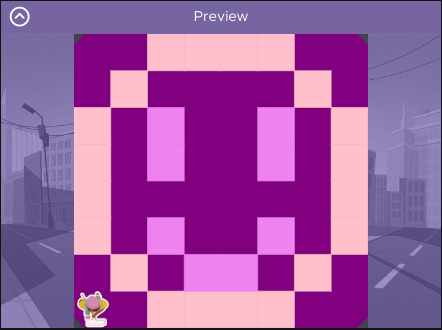

# Unit 1 - Asphalt Art

## Introduction

Cities use asphalt art to improve public safety, inspire their residents and visitors, and brighten communities. Your goal is to create asphalt art to revitalize The Neighborhood and bring the community together with the help of the Painter.

## Requirements

Use your knowledge of object-oriented programming, algorithms, the problem solving process, and decomposition strategies to create asphalt art:
- **Create a new subclass** – Create at least one new subclass of the PainterPlus class that is used for a component of the asphalt art design.
- **Plan an algorithm** – Use the problem solving process and decomposition strategies to plan an algorithm that incorporates a combination of sequencing, selection, and/or iteration.
- **Write a method** – Write at least one method in a PainterPlus subclass that contributes to a component of the asphalt art design.
- **Document your code** – Use comments to explain the purpose of the methods and code segments.

## Notes: Neighborhood & Painter Class

This project was created on Code.org's JavaLab platform using the built in Neightborhood GUI output. To test and edit this project you must build in Code.org's JavaLab with the Neighborhood GUI enabled. For reference to the Painter class documentation, [you can read more here.](https://studio.code.org/docs/ide/javalab/classes/Painter)

## Output:
Sketch:

Output:

## Reflection

1. Describe your project.

   This project is about making asphalt art by making a smiley face. The user can make a unique smiley face by choosing the background color, the color of the outline of the smiley face, the color of the eyes, and the color of the mouth.

2. What are two things about your project that you are proud of?

   I am proud of how it sets an a happy image while also allowing room for creativity by letting users choose their colors and create many variations of smiley faces. I also like that although it's simple, it's universally the symbol of happiness and can put a positive mood on a neighborhood.

3. Describe something you would improve or do differently if you had an opportunity to change something about your project.

   a.) I would add another method so that instead of the background being the same as the color of the smiley face, the smiley face can have it's own color.
   b.) Something I would do differently is get a bigger graph and add shading into the smiley face or rosy cheeks to the smiley face to really enhance it's happiness.
